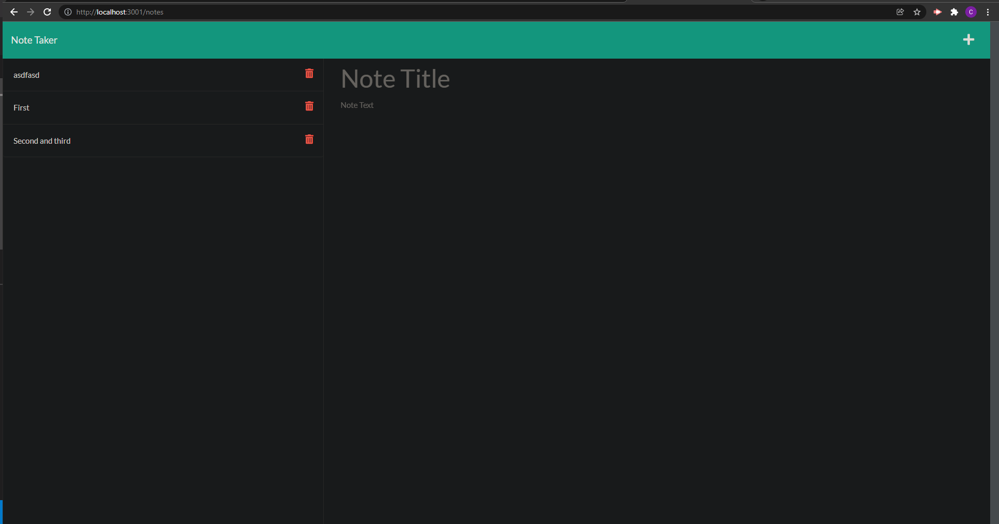

# note-taker

## Description

An app that takes notes an saves them on a server to be called back later. Notes can also be deleted individually as tasks are completed or unneeded.

## [Try it yourself!]

The following image show a glimpse of the application:

## Getting Started

This is a simple application that runs right in the browser, no installation or downloads needed. The backend is handled entirely by the server

## Built With:

Express.js  
Node.js  
Javascript

## Author:

Chris Muto

## Special Thanks for Collaboration:

David Luu, Tyler Oliveira and Oscar Silva

## Planned Updates

There are no plans to further update this application at this time.